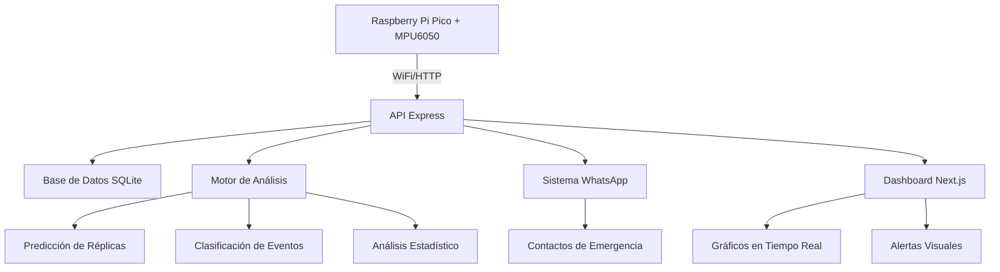

# 🌍 Sistema Completo de Detección Sísmica IoT

Sistema integral para detección, análisis y alerta de actividad sísmica usando IoT (Raspberry Pi Pico + MPU6050) con API Express, análisis predictivo, notificaciones WhatsApp y dashboard Next.js.

## 📋 Tabla de Contenidos

- [🎯 Visión General](#-visión-general)
- [🏗️ Arquitectura del Sistema](#️-arquitectura-del-sistema)
- [🚀 Instalación y Configuración](#-instalación-y-configuración)
- [📡 API REST Endpoints](#-api-rest-endpoints)
- [🔧 Configuración IoT](#-configuración-iot)
- [💻 Frontend Dashboard](#-frontend-dashboard)
- [📊 Análisis y Algoritmos](#-análisis-y-algoritmos)
- [📱 Sistema de Notificaciones](#-sistema-de-notificaciones)
- [🛠️ Monitoreo y Mantenimiento](#️-monitoreo-y-mantenimiento)
- [🧪 Testing y Validación](#-testing-y-validación)
- [📈 Performance y Escalabilidad](#-performance-y-escalabilidad)
- [🚨 Solución de Problemas](#-solución-de-problemas)

## 🎯 Visión General

### Componentes del Sistema



### Flujo de Datos

1. **Sensor MPU6050** detecta movimiento sísmico
2. **Raspberry Pi Pico** procesa datos y envía vía WiFi
3. **API Express** recibe, valida y almacena eventos
4. **Motor de Análisis** clasifica eventos y calcula predicciones
5. **Sistema de Notificaciones** envía alertas automáticas
6. **Dashboard** muestra datos en tiempo real

## 🏗️ Arquitectura del Sistema

### Backend (API Express)

```
servidor_express/
├── server.js                 # Aplicación principal
├── database/
│   ├── init.js              # Inicialización DB
│   └── earthquake_monitor.db # Base de datos SQLite
├── routes/
│   ├── earthquakes.js       # Endpoints de eventos
│   ├── analysis.js          # Endpoints de análisis
│   └── notifications.js     # Endpoints de notificaciones
├── services/
│   ├── analysis.js          # Algoritmos de análisis
│   └── notifications.js     # Integración WhatsApp
├── tests/
│   ├── test_api.sh         # Tests automatizados
│   ├── pico_complete_code.md # Código completo Pico
│   └── nextjs_integration_example.md # Integración Next.js
├── logs/                    # Logs del sistema
├── monitor_system.sh        # Script de monitoreo
├── package.json
├── .env
└── README.md
```

### Hardware IoT

```
pico_earthquake_detector/
├── main.cpp                 # Código principal Pico
├── Config.h                # Configuraciones
├── sensors/
│   ├── mpu6050.h           # Driver sensor
│   └── mpu6050.cpp
├── lib/
│   ├── Esp8266HttpServer.h # Cliente HTTP
│   └── Esp8266HttpServer.cpp
└── CMakeLists.txt          # Configuración CMake
```

### Frontend (Next.js)

```
earthquake-dashboard/
├── pages/
│   ├── dashboard.js        # Dashboard principal
│   ├── events.js          # Lista de eventos
│   └── analytics.js       # Análisis y estadísticas
├── components/
│   ├── SeismicChart.js    # Gráficos sísmicos
│   ├── EventCard.js       # Tarjetas de eventos
│   ├── RealTimeAlert.js   # Alertas en tiempo real
│   └── StatsSummary.js    # Resumen estadísticas
├── lib/
│   ├── api.js             # Cliente API
│   └── websocket.js       # WebSocket tiempo real
└── styles/
    └── globals.css        # Estilos Tailwind
```

## 🚀 Instalación y Configuración

### 1. Servidor Express API

```bash
# Clonar repositorio
git clone <repo>
cd servidor_express

# Instalar dependencias
npm install

# Configurar variables de entorno
cp .env.example .env
nano .env
```

**Variables de Entorno (.env)**
```env
PORT=3000
DB_PATH=./database/earthquake_monitor.db

# WhatsApp Business API
WHATSAPP_TOKEN=your_whatsapp_business_token
WHATSAPP_PHONE_ID=your_whatsapp_phone_number_id
WHATSAPP_VERIFY_TOKEN=your_webhook_verify_token

# Contactos de emergencia
EMERGENCY_CONTACTS=["1234567890","0987654321"]

# Umbrales de detección
EARTHQUAKE_THRESHOLD=15.0
VIBRATION_THRESHOLD=8.0
NOISE_THRESHOLD=2.0

# Configuración de análisis
AFTERSHOCK_TIME_WINDOW=168
CONFIDENCE_THRESHOLD=0.7
```

```bash
# Inicializar base de datos
npm run init-db

# Iniciar servidor
npm start

# Verificar instalación
curl http://localhost:3000/api/health
```

### 2. Hardware IoT (Raspberry Pi Pico)

**Conexiones Hardware:**
```
Raspberry Pi Pico    MPU6050      ESP8266
├── Pin 4 (SDA) ────► SDA
├── Pin 5 (SCL) ────► SCL
├── Pin 0 (TX)  ──────────────► RX
├── Pin 1 (RX)  ──────────────► TX
├── 3.3V        ────► VCC ────► 3.3V
└── GND         ────► GND ────► GND
```

**Compilación:**
```bash
# Compilar código Pico
mkdir build && cd build
cmake .. -DCMAKE_BUILD_TYPE=Release
make

# Flashear (Pico en modo BOOTSEL)
cp earthquake_detector.uf2 /media/RPI-RP2/
```

### 3. Dashboard Next.js

```bash
# Crear proyecto Next.js
npx create-next-app@latest earthquake-dashboard --typescript --tailwind

cd earthquake-dashboard

# Instalar dependencias
npm install recharts date-fns socket.io-client

# Configurar variables
echo "NEXT_PUBLIC_API_URL=http://localhost:3000/api" > .env.local

# Iniciar desarrollo
npm run dev
```

## 📡 API REST Endpoints

### Eventos Sísmicos

**POST /api/earthquakes/event** - Recibir evento desde IoT
```json
{
  "device_id": "PICO_SENSOR_001",
  "timestamp": "2024-01-15T14:30:25.123Z",
  "event_type": "earthquake",
  "acceleration_x": 12.5,
  "acceleration_y": 8.3,
  "acceleration_z": 15.7,
  "total_acceleration": 22.1,
  "gyro_x": 45.2,
  "gyro_y": -23.1,
  "gyro_z": 67.8,
  "magnitude": 6.2,
  "is_significant": true
}
```

**GET /api/earthquakes** - Listar eventos
- Query params: `limit`, `offset`, `event_type`, `device_id`, `start_date`, `end_date`

**GET /api/earthquakes/:id** - Obtener evento específico

### Análisis Predictivo

**GET /api/analysis/stats/general?days=30** - Estadísticas generales
```json
{
  "total_events": 156,
  "earthquakes": 23,
  "vibrations": 89,
  "average_magnitude": 3.7,
  "max_magnitude": 6.8,
  "most_active_device": "PICO_SENSOR_001",
  "daily_average": 5.2
}
```

**GET /api/analysis/trends/activity?hours=24** - Tendencias de actividad

**GET /api/analysis/aftershocks/:eventId** - Análisis de réplicas

### Control del Raspberry Pi Pico

**POST /api/pico/buzzer** - Activar buzzer del Pico
```json
{
  "success": true,
  "message": "Buzzer activado correctamente",
  "timestamp": "2024-01-15T14:30:25.123Z"
}
```

**POST /api/pico/morse** - Enviar mensaje Morse
```json
// Request
{
  "text": "SOS"
}

// Response
{
  "success": true,
  "message": "Mensaje Morse enviado: \"SOS\"",
  "text": "SOS",
  "timestamp": "2024-01-15T14:30:25.123Z"
}
```

**GET /api/pico/status** - Verificar estado del Pico
```json
{
  "success": true,
  "message": "Pico está en línea",
  "pico_ip": "192.168.1.100",
  "pico_port": 80,
  "timestamp": "2024-01-15T14:30:25.123Z"
}
```

**POST /api/pico/sensor-data** - Recibir datos del sensor MPU6050
```json
// Request desde Pico
{
  "device_id": "pico_sensor_01",
  "acceleration_x": 1.2,
  "acceleration_y": -0.8,
  "acceleration_z": 9.8,
  "gyro_x": 0.1,
  "gyro_y": 0.05,
  "gyro_z": -0.02,
  "temperature": 24.5,
  "timestamp": "2024-01-15T14:30:25.123Z"
}

// Response
{
  "success": true,
  "message": "Datos del sensor procesados correctamente",
  "data": {
    "device_id": "pico_sensor_01",
    "acceleration": { "x": 1.2, "y": -0.8, "z": 9.8 },
    "total_acceleration": "9.89",
    "is_seismic_event": false,
    "timestamp": "2024-01-15T14:30:25.123Z"
  }
}
```

**GET /api/analysis/prediction/simple** - Predicción simple de riesgo

### Notificaciones WhatsApp

**POST /api/notifications/send** - Enviar notificación manual
```json
{
  "event_id": 123,
  "phone_number": "1234567890",
  "message": "Alerta sísmica personalizada"
}
```

**GET /api/notifications/history?limit=50** - Historial de notificaciones

**POST /api/notifications/contacts** - Actualizar contactos de emergencia

### Sistema

**GET /api/health** - Estado del sistema
```json
{
  "status": "healthy",
  "uptime": 3600,
  "database": "connected",
  "whatsapp": "configured",
  "version": "1.0.0"
}
```

## 🔧 Configuración IoT

### Configuración del Sensor MPU6050

```cpp
// Config.h - Configuraciones principales
#define WIFI_SSID "Tu_Red_WiFi"
#define WIFI_PASSWORD "Tu_Contraseña"
#define API_HOST "192.168.1.100"  // IP del servidor
#define API_PORT 3000

// Umbrales de detección
#define EARTHQUAKE_THRESHOLD 15.0   // m/s² para terremoto
#define VIBRATION_THRESHOLD 8.0     // m/s² para vibración
#define NOISE_THRESHOLD 2.0         // m/s² ruido de fondo

// Configuración del sistema
#define DEVICE_ID "PICO_SENSOR_001"
#define SAMPLE_RATE_MS 100          // Muestreo cada 100ms
#define SEND_INTERVAL_MS 5000       // Enviar cada 5 segundos
```

### Características del Sistema IoT

- **Filtrado Digital**: Media móvil de 10 muestras
- **Calibración Automática**: Compensación de offset
- **Clasificación Inteligente**: Terremotos vs vibraciones
- **Buffer Local**: Almacena hasta 50 eventos
- **Reintentos Automáticos**: Hasta 3 intentos de envío
- **Watchdog**: Reinicio automático en caso de fallo
- **Alertas Locales**: LED y buzzer para eventos críticos

## 💻 Frontend Dashboard

### Características Principales

1. **Dashboard en Tiempo Real**
   - Gráficos de actividad sísmica
   - Mapa de eventos (opcional)
   - Alertas visuales y sonoras
   - Estadísticas en vivo

2. **Análisis Histórico**
   - Tendencias temporales
   - Comparativas por dispositivo
   - Reportes exportables
   - Filtros avanzados

3. **Gestión del Sistema**
   - Configuración de umbrales
   - Gestión de contactos
   - Estado de dispositivos
   - Logs del sistema

### Componentes React

```jsx
// Dashboard principal con datos en tiempo real
<Dashboard>
  <StatsSummary stats={stats} prediction={prediction} />
  <SeismicChart events={events} />
  <EventsList events={recentEvents} />
  <RealTimeAlert />
</Dashboard>

// Configuración de alertas
<AlertConfig>
  <ThresholdSettings />
  <ContactManagement />
  <NotificationHistory />
</AlertConfig>
```

## 📊 Análisis y Algoritmos

### Clasificación de Eventos

```javascript
function classifyEvent(acceleration, magnitude) {
  if (acceleration > EARTHQUAKE_THRESHOLD) {
    return {
      type: 'earthquake',
      severity: magnitude > 6.0 ? 'critical' : 'moderate',
      alertRequired: true
    };
  } else if (acceleration > VIBRATION_THRESHOLD) {
    return {
      type: 'vibration', 
      severity: 'low',
      alertRequired: false
    };
  }
  return { type: 'normal', severity: 'none', alertRequired: false };
}
```

### Cálculo de Magnitud

```javascript
function calculateMagnitude(totalAcceleration) {
  // Conversión logarítmica basada en aceleración
  const magnitude = Math.log10(totalAcceleration / NOISE_THRESHOLD) + 1.0;
  return Math.max(0.0, Math.min(magnitude, 9.0));
}
```

### Predicción de Réplicas (Ley de Omori)

```javascript
function calculateAftershockProbability(mainEvent, timeWindow) {
  const K = 0.1; // Constante de productividad
  const c = 0.1; // Constante de tiempo (días)
  const p = 1.1; // Exponente de decaimiento
  
  const rate = K / Math.pow(timeWindow + c, p);
  const probability = 1 - Math.exp(-rate * timeWindow);
  
  return {
    probability_percentage: probability * 100,
    confidence: getConfidenceLevel(mainEvent.magnitude),
    time_window_hours: timeWindow * 24
  };
}
```

### Análisis Estadístico

- **Frecuencia de Eventos**: Distribución temporal
- **Intensidad Promedio**: Media móvil de magnitudes
- **Patrones Estacionales**: Análisis de tendencias
- **Correlación Espacial**: Múltiples sensores (futuro)

## 📱 Sistema de Notificaciones

### WhatsApp Business API Integration

```javascript
// Envío automático de alertas
async function sendEmergencyAlert(event) {
  const message = formatAlertMessage(event);
  const contacts = await getEmergencyContacts();
  
  for (const contact of contacts) {
    await sendWhatsAppMessage(contact, message);
  }
}

function formatAlertMessage(event) {
  return `
🚨 ALERTA SÍSMICA
📍 Dispositivo: ${event.device_id}
🕐 Hora: ${formatTimestamp(event.timestamp)}
📊 Magnitud: ${event.magnitude.toFixed(1)}
⚡ Aceleración: ${event.total_acceleration.toFixed(1)} m/s²
🔮 Prob. Réplica (6h): ${event.aftershock_probability}%
`;
}
```

### Configuración de Alertas

**Criterios de Alerta Automática:**
- Magnitud > 6.0 (Terremoto significativo)
- Aceleración > 20 m/s² (Evento crítico)
- Probabilidad de réplica > 70%
- Múltiples eventos en 1 hora

**Tipos de Notificación:**
- 🚨 **Crítica**: Terremoto mayor (Mag > 7.0)
- ⚠️ **Alta**: Terremoto moderado (Mag 5.0-7.0)
- 📳 **Media**: Vibración significativa
- ℹ️ **Info**: Resumen diario/semanal

## 🛠️ Monitoreo y Mantenimiento

### Script de Monitoreo Automático

```bash
# Monitor interactivo del sistema
./monitor_system.sh

# Verificación única
./monitor_system.sh check

# Generar reporte completo
./monitor_system.sh report

# Test de conectividad IoT
./monitor_system.sh test
```

### Métricas del Sistema

- **Disponibilidad**: >99.5% uptime objetivo
- **Latencia**: <100ms respuesta promedio
- **Throughput**: 1000+ eventos/hora
- **Almacenamiento**: ~10MB/mes por sensor
- **CPU**: <5% uso normal, <20% picos

### Backup y Recuperación

```bash
# Backup automático diario
0 2 * * * /path/to/backup_script.sh

# Backup manual
sqlite3 database/earthquake_monitor.db ".backup backup_$(date +%Y%m%d).db"

# Restauración
sqlite3 database/earthquake_monitor.db ".restore backup_20240115.db"
```

## 🧪 Testing y Validación

### Testing Automatizado

```bash
# Ejecutar suite completa de tests
npm test

# Test específico de API
./tests/test_api.sh

# Test de carga
npm run load-test

# Test de integración IoT
./tests/test_iot_integration.sh
```

### Simulación de Eventos

```bash
# Simular evento sísmico
curl -X POST http://localhost:3000/api/earthquakes/event 
  -H "Content-Type: application/json" 
  -d '{
    "device_id": "TEST_DEVICE",
    "event_type": "earthquake",
    "total_acceleration": 18.5,
    "magnitude": 6.2,
    "is_significant": true
  }'

# Simular múltiples eventos
for i in {1..10}; do
  ./tests/simulate_event.sh
  sleep 2
done
```

### Validación de Algoritmos

- **Test de Clasificación**: Verificar umbrales
- **Test de Magnitud**: Comparar con datos reales
- **Test de Predicción**: Validar con eventos históricos
- **Test de Latencia**: Medir tiempo de respuesta

## 📈 Performance y Escalabilidad

### Optimizaciones Implementadas

1. **Base de Datos**
   - Índices en campos de consulta frecuente
   - Paginación en endpoints
   - Conexión pooling

2. **API**
   - Rate limiting (100 req/15min)
   - Compresión gzip
   - Caching de consultas frecuentes

3. **IoT**
   - Buffer local de eventos
   - Envío batch para eficiencia
   - Reconexión automática WiFi

### Escalabilidad Horizontal

**Para múltiples sensores:**
```javascript
// Load balancer configuration
const sensors = [
  { id: 'PICO_001', location: 'Building_A', priority: 'high' },
  { id: 'PICO_002', location: 'Building_B', priority: 'medium' },
  { id: 'PICO_003', location: 'Building_C', priority: 'low' }
];

// Distributed processing
sensors.forEach(sensor => {
  processSeismicData(sensor.id, sensor.priority);
});
```

**Para alta disponibilidad:**
- Load balancer (nginx/HAProxy)
- Multiple API instances
- Database replication
- Redis cache layer

## 🚨 Solución de Problemas

### Problemas Comunes y Soluciones

**1. Sensor MPU6050 no responde**
```bash
# Verificar conexión I2C
i2cdetect -y 1

# Verificar alimentación
# Verificar cables SDA/SCL
# Reiniciar calibración
```

**2. WiFi no conecta**
```cpp
// Verificar credenciales en Config.h
#define WIFI_SSID "Red_Correcta"
#define WIFI_PASSWORD "Password_Correcta"

// Verificar señal WiFi
// Probar con hotspot móvil
// Verificar firewall del router
```

**3. API no recibe datos**
```bash
# Verificar puerto abierto
sudo ufw allow 3000

# Verificar IP del servidor
ifconfig

# Test de conectividad
ping <IP_SERVIDOR>
curl http://<IP_SERVIDOR>:3000/api/health
```

**4. Base de datos corrupta**
```bash
# Verificar integridad
sqlite3 database/earthquake_monitor.db "PRAGMA integrity_check;"

# Reparar si es necesario
sqlite3 database/earthquake_monitor.db "VACUUM;"

# Restaurar desde backup
cp backup_latest.db database/earthquake_monitor.db
```

**5. WhatsApp no envía mensajes**
```bash
# Verificar token
curl -H "Authorization: Bearer $WHATSAPP_TOKEN" 
  https://graph.facebook.com/v18.0/me

# Verificar configuración webhook
# Renovar token si es necesario
# Verificar número de teléfono verificado
```

### Logs y Debugging

```bash
# Logs en tiempo real
tail -f logs/app.log

# Buscar errores específicos
grep "ERROR" logs/app.log | tail -20

# Logs de dispositivos IoT
grep "device_id" logs/app.log | grep "PICO_001"

# Estadísticas de performance
grep "response_time" logs/app.log | awk '{sum+=$NF} END {print sum/NR}'
```

### Contacto y Soporte

- 📧 **Email**: soporte@earthquake-monitor.com
- 📱 **WhatsApp**: +1234567890  
- 🐛 **Issues**: GitHub Issues
- 📖 **Documentación**: Wiki completa
- 💬 **Community**: Discord/Slack

---

## ⚠️ Disclaimer de Seguridad

**IMPORTANTE**: Este sistema está diseñado para monitoreo educativo y alerta temprana complementaria. No debe ser utilizado como único método de detección sísmica para aplicaciones críticas de seguridad o protección civil. Para aplicaciones críticas, consulte con sistemas profesionales certificados y autoridades locales de gestión de emergencias.

## 📄 Licencia

MIT License - Ver archivo [LICENSE](LICENSE) para más detalles.

---

*Sistema desarrollado para educación e investigación en detección sísmica IoT* 🌍
